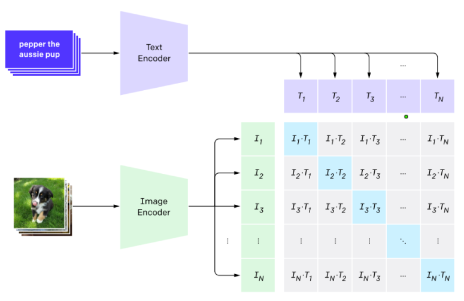
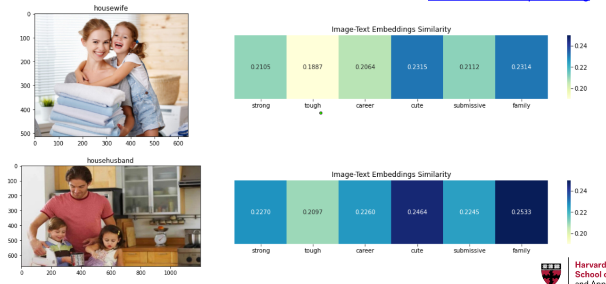
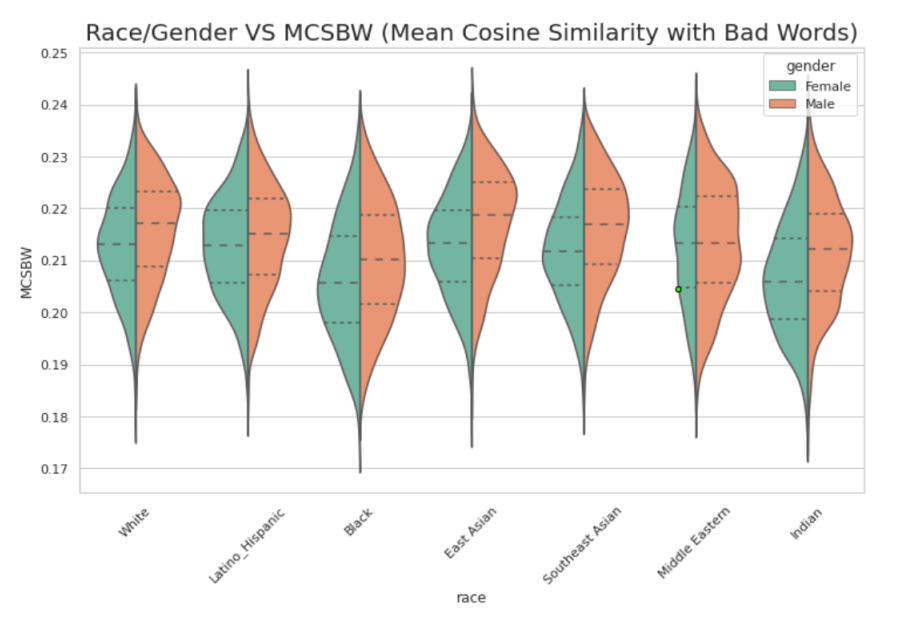
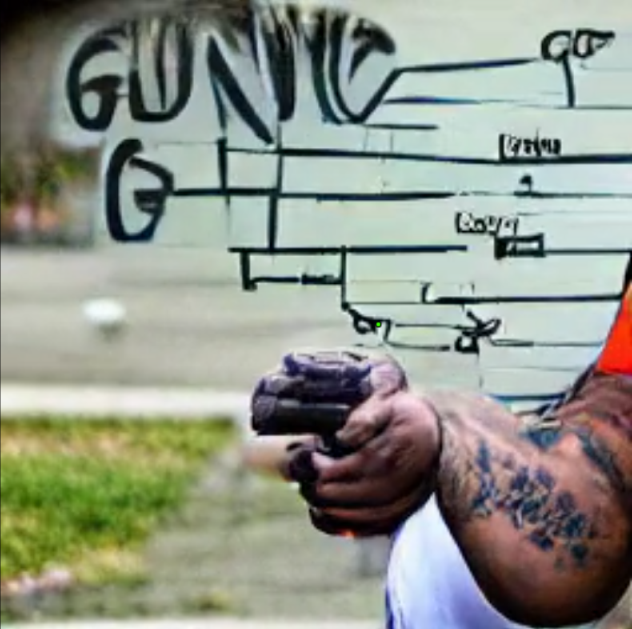

# AC 221 Final Project: Gender Bias in Text & Image Embeddings
:fountain_pen::camera_flash::people_holding_hands:

Yuanbiao Wang, Angel Hsu, Morris Reeves, Xinyi Li


## :white_check_mark: Motivation

Since text and images are two primary modes of communication in our society, it is of significant importance to explore bias in these two contexts, identify ways to mitigate bias in these two modes, and explore the potential connections between working with bias in the two modes. Commonly, learned representations, the numerical vector representations of either text or images learned from large pre-trained neural networks, are used to perform transfer learning on downstream tasks. As such models increase in complexity, it is increasingly important to examine the biases in these unexplainable vector representations, and that will be our focus in this project.

In this project, we prioritized exploring bias in text by (1) training our own embeddings to identify where bias may originate from, (2) identifying whether existing embeddings have bias, and (3) using biased embeddings for classification to identify whether bias in embeddings diffuse to downstream tasks. We also supplemented this analysis by exploring cross-modal representations produced by CLIP, a self-supervised learning algorithm that aims to acquire cross-modal representations by contrasting co-occurring texts and images. CLIP was introduced by OpenAI in 2021; the algorithm is garnering attention in many fields, including text-prompted image generation, visual question answering, and image captioning. While this new algorithm shows great potential in bridging semantic understanding between images and text, it also embodies new ethical risks by introducing risks from both areas.


## :books: Final Deliverables

Our project is heavily coding-based and we employed some of the most up-to-date deep neural networks to detect their fairness. Our approaches can be generalized to any other state-of-the-art deep models and we will provide with you the instructions to use our code and the motivation behind our designs.

Our write-up can be found **in this README file**, but you can also expect to see a large proportion of the detailed descriptions and result analyses, as well as the ethical thinkings in the jupyter notebooks we provide:

- [Train a word2vec in scratch and explore how biases can be generated](word2vec_training.ipynb)
- [Exploring biases in existing text embeddings](task2-bias_in_pretrained_word_embeddings.ipynb)
- [How biases in embeddings diffuse to downstream tasks](sentiment_prediction.ipynb)
- [Visualize the embeddings and stereotypical words with CLIP](AC221_CLIP_Vis.ipynb)
- [Quantitive Analysis using the CLIP embedding and offensive word list](CLIP_Quant.ipynb)

We also include our presentation slides that outline our work: [Presentation Slides with videos](https://docs.google.com/presentation/d/1jA6-yPFEQhaab1anV6qQDywxgFnN_lAWq8BicMptZOg/edit?usp=sharing)

## :memo:Definition and Metrics

For this project, we primarily focus on gender bias and we define bias using the following 2 metrics.

### Bias definition 1: cosine similarity with offensive words
#### Definition
We have a list of male word and female word listed below.
```python
male_words = ['he', 'male', 'man', 'father', 'boy', 'husband']
female_words = ['she', 'female', 'woman', 'mother', 'girl', 'wife']
```
We also have a list of offensive/profane word from CMU: https://www.cs.cmu.edu/~biglou/resources/

So we define the bias using the cosine similarity between 2 embedding vectors. If a gender-related word has higher cosine similarity with an offensive word compared to the corresponding word for the opposite gender, then we believe the embedding has a bias against that gender. We take the mean cosine similarity defined as follows to aggregate the performance over the offensive word list.


#### Usage 

```python
from badword_matric import calculate_cos_with_badwords
res = calculate_cos_with_badwords(embedding={'word1':emb1, 'word2':emb2, ...})
## emb1 and 2 must be np.array
## res = {('male', 'female'):[x, y], ('he', 'she'):[x, y], ...}
## x is a list of cosine similarity of the m word and bad words that are in embedding
## y is a list of cosine similarity of the f word and bad words that are in embedding
```

### Bias definition 2: WEAT score
#### Definition
As implied by its name, the WEAT (Word Embedding Association Test) score measured bias in associations. Introduced by Caliskan et al. (2016), the WEAT score attempts to capture the strength of the association between two sets of target words (e.g. {math, science} and {art, literature}) and two sets of attribute words (e.g. {male, man} and {female, woman}). Intuitively, the score asks: is male/man more associated with math/science than art/literature, relative to female/woman? It does so through comparisons of mean cosine similarities:


where:


We use the same word lists in Caliskan et al. for the comparisons (Math vs. Arts) and (Science vs. Arts), to avoid the risk of manipulating our results to achieve certain conclusions. To compute the WEAT score, we use the **responsibly** package ([link](https://github.com/ResponsiblyAI/responsibly)), following the demos at the [docs](https://docs.responsibly.ai/notebooks/demo-word-embedding-bias.html).

## 	:hot_pepper:Tasks

This section includes brief introduction and conclusions w.r.t the 5 tasks we experimented with. Please refer to the jupyter notebooks we referred to earlier for more details and analyses.

### Bias in Embeddings trained from scratch

We explore the sources of bias (as measured by the 2 metrics above) by training our own embeddings using various configurations of:

* Data source (Twitter, Reddit, CNN/DailyMail)
* Dataset size (10k, 15k, 20k, 25k, 30k documents)

For word2vec model training, we use the CBOW implementation from the **gensim** package, with parameters: context window size of 5, minimum word count of 5, learning rate of 0.01, and 15 epochs. After training word2vec using each of the combinations of configurations (of data source and dataset size above), we compute the two bias metrics above. 

Please see our [word2vec_training.ipynb](https://github.com/CindyLi-Ayi/AC221-Final-Project-Embedding-Bias/blob/main/word2vec_training.ipynb) notebook for the associated code and additional details.

### Bias in Existing Word Embeddings

We think it is very important to examine the bias in existing embeddings since people too often just use these pretrained embeddings and trust them in their performance as well as fairness. At the same time, we hope to find clues of where the bias could come from by conducting comparative studies across different embeddings and also of their variants, and also obtain information on which embedding is less biased when fairness is an important concern of our project. 

In this task, we examined 3 types of common embeddings - Glove, Word2vec and ELMo. As a summary of our findings, we think there is definitely bias in these pretrained word embeddings, but their level of bias varies. Therefore, users have the choice of using a less biased embedding during their training process. Most importantly, they should try to avoid the embeddings trained on informal datasets like Twitter. Other less significant factors include embedding dimension, dataset size and depth of embedding layers. Additionally, if users would like to train embeddings themselves, they may also want to be cautious when deciding which corpus to train on as well as considering the aforementioned factors.

More details about this task can be found in `task2-bias_in_pretrained_word_embeddings.ipynb`. You will need to first download the embeddings with

```python
./get_data.sh
```


### Whether Bias in Embeddings Diffuses into Downstream Tasks (Sentiment Prediction and Analysis)

As a logical next step in our analysis, we are interested in examining whether bias in embeddings may potentially diffuse into downstream tasks, such as sentiment prediction and analysis. To complete this process, we utilized the Global Vectors for Word Representation (GloVe) Model trained on two different embeddings as detailed below, derived from the above excerise to maintain the continuity of our analysis:

*   Twitter (2B tweets, 27B tokens, 1.2M vocab, uncased, 25d, 50d, 100d, & 200d vectors, 1.42 GB download): https://nlp.stanford.edu/data/glove.twitter.27B.zip
*   Wikipedia 2014 + Gigaword 5 (6B tokens, 400K vocab, uncased, 50d, 100d, 200d, & 300d vectors, 822 MB download): https://nlp.stanford.edu/data/glove.6B.zip

In training these two GloVe models each on a different embedding, we are able to hold the methodology constant (using GloVe for both models) to clearly identify whether the bias in embeddings diffuses to downstream tasks, such as sentiment prediction. When comparing the results from the two models, we obtain the following conclusions. First, the Twitter embedding used in the GloVe model contains considerable bias in sentiment prediction results between female-associated words and male-associated words compared to the Wikipedia and Gigaword embedding used to train the other GloVe model. Second, among sentiment prediction scoring between female-associated words and male-associated words using the Twitter embedding to train our GloVe model, we see a disproportionately higher prediction proportion of female-associated words as negative compared to that of male-associated words, and a disproportionately lower prediction proportion of female-associated words as positive compared to that of male-associated words, indicating the potential flow of bias from embeddings into downstream tasks for sentiment prediction. Finally, we see a much more uniform landscape of sentiment prediction scores among female-associated words and male-associated words when using the Wikipedia and Gigaword embeddings to train our GloVe model. This considerable discrepancy in the distribution of predicted sentiment scores between the two GloVe models trained on the Twitter and Wikipedia and Gigaword embeddings supports our hypothesis that bias in embeddings may have effects that transfer and diffuse to downstream tasks (e.g. sentiment prediction in our example use case).

### Bias in Image Embedding (CLIP)

#### Language-Image Contrastive Learning

Historically, deep neural nets for computer vision work in this routine: first a large dataset with labeled images are collected, and then task-specific model are trained on this dataset using supervised learning algorithms. The problem with this approach is that the collection and labelling of the dataset is exceptionally expensive, especially for tasks like semantic segmentation and object detection. Meanwhile, the outcome or the trained model, can only be used on this one specific task. The high cost-benefit ratio makes many companies and researchers unsatisfied.

Recently, more and more people have been turning their focus to unsupervised representational learning. In this learning diagram, an even larger dataset without labels are created and then unsupervised learning algorithms like SimCLR will be employed to excavate the interior structural information of the data, subsequently yielding abstracted visual representations of images. These image representations are usually high-dimensional vectors and it has been proved by many works that they can be useful plug-ins for any downstream tasks.

CLIP (Contrastive Language Image Pretraining) is a new algorithm proposed by OpenAI to bridge the gap between image and text. To do this, the researchers collected a dataset 30 times larger than ImageNet, called WIT (Web Image Text), which contains around 400 million images and their co-occurent texts. The CLIP model consists of two components, an image encoder and a text encoder, both of which will generate a vectorized representations, or embeddings. By maximizing the cosine similarities between relevant images and texts while minizing irrelevant image-text pairs' cosine similarity, the CLIP model will learn to represent both modalities in an uniform way.



#### Ethic issues uncovered in CLIP

In the [paper](https://arxiv.org/pdf/2103.00020.pdf) where CLIP is proposed, the author identified some of the stakeholders and analyzed the ethical issues in CLIP. You can also take a look at [my analysis about its ethical section](https://edstem.org/us/courses/15798/discussion/1221622). Aside from the possible surveillance problems, the author focused on the bias in the model that may bring harm to certain demographic groups. For examples, the paper compared the probability for each of the racial groups to be classified as primates and non-human subjects. If the model gives such predictions more frequently for certain groups of people, it will be considered as very much offensive. It also compares the top classes for men and women to examine the possible prejudices embedded in the model.

However, the analyses are mostly based on the classification although it is claimed before that CLIP will be a generic encoder that will adapt to several downstream tasks. Therefore, we find it equally important to examine the fairness in the image representations it gets, just like what we did with the language models.

#### Experiments
In our work, we performed 3 experiments to explore whether there are potential biases in the CLIP image embeddings.

1. The correlations between images and stereotypical texts

    Notebook: [[Visualize the embeddings and stereotypical words with CLIP]](AC221_CLIP_Vis.ipynb)

    First, we take some images of certain groups, and compare their cosine similarities with some words that we think might be correlated with stereotypes and prejudices. More technically, we cut the images in patches, and compare their cosine similarities with each words in a sentence and find the maximum one. We first explore whether there are gender biases in CLIP. For example, "strong", "tough", and "career" might conventionally be used to depict a man in a stereotypical context, and words like "cute", "submissive", and "family" are biased descriptions about women. If we see there is a high correlation between the stereotypical words and the picture, we can assert that the embeddings are somehow biased. During the experiment we found that although the picture of a househusband is more associated with masculine-stereotypical words like "strong" and "career", it also has higher cosine similarities with feminine-stereotypical words like "cute" and "family". 

    

    We did many similar experiments and found the results are aligned. The CLIP won't give high similarities between stereotypical words and the image simply because of the person's appearance. Quite contrary to our presumption about the potential biases, the CLIP model actually cares more about the image context and might entail more fairness than we have imagined, which is a good thing. The results are displayed both in the notebook and the slides we provided.

2. Quantitively measuring the biases in CLIP
    [Quantitive Analysis using the CLIP embedding and offensive word list](CLIP_Quant.ipynb).
    After we reach a coarse conclusion with the visualization, can we assert that CLIP is perfectly fair? Actually no. We must be aware that when we select the picture for visualization, we might fall into the pit of selection bias. The pictures we selected might not be representative and inclusive enough. To carry out a comprehensive study, we need to use a large quantity of representative images and texts.

    Gladly, Facebook has a dataset for fairness evaluation called [FairFace](https://openaccess.thecvf.com/content/WACV2021/papers/Karkkainen_FairFace_Face_Attribute_Dataset_for_Balanced_Race_Gender_and_Age_WACV_2021_paper.pdf). It is composed of 108,501 faces from each racial, gender and age groups and it makes sure that no group is underrepresented compared to other trending datasets like CelebA or CoCo. We use this dataset for our quantitive analysis.

    As for the text part, we still employ the offensive wordlist we used in previous sections. We take the average cosine similarities with each image and all the offensive words as the bias metric. The higher the average cosine similarity score is, the more bias we think that the CLIP model has against this person. We visualize the distribution of each group using violin plot to get a intuition about the CLIP model's fairness.

    

    The conclusion we reached from the result is that CLIP is most unfriendly and biased against men, East Asians, teenagers and the middle-aged. 

3. Image generation

    As we have demonstrated before, the ethical analyses in the original CLIP paper are more concentrated on classification problem and overlook other downstream tasks. Here we chose the image generation problem as it is prevalent these days and will have serious ethical implications if biases are not identified. 

    We are using [this notebook](https://colab.research.google.com/drive/1_4PQqzM_0KKytCzWtn-ZPi4cCa5bwK2F?usp=sharing) created by Katherine Crowson and modified by Prof. Philip Isola. Briefly speaking, we attach an image generator(VQGAN) and input the generated image into the CLIP image encoder and try to minize the cosine similarity between the image and the embedding of a given text prompt.

    We find it very scary that the model outputs an arm of an African-American using this prompt: "A street gang member is accused of gun violence and grand theft". If this model is used for geographical profiling, it will be very dubious about the result that the model gives.

    

    There are also several other examples we tried and you may take a look at them in the appendix part in our slides.


## :brain: Key Takeaways

A few takeaways from our analyses above include: first, all of the data sources and computational methods that contribute to the embeddings and the evaluation of their fairness, like training data, bias evaluation metrics, embedding space selection, downstream tasks, all have significant impact on the result. Additionally, because CLIP-like image encoders are trained with co-occurent texts, they are also correlated with the contexts on which they are trained and are thus not immune to bias. Therefore, we must always be extremely cautious about the methods and parameters we use to build the text and image embeddings as they will bring about biases that will impact stakeholders.


